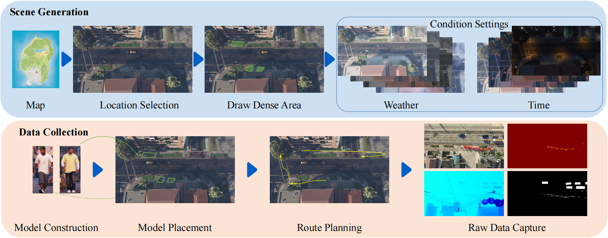
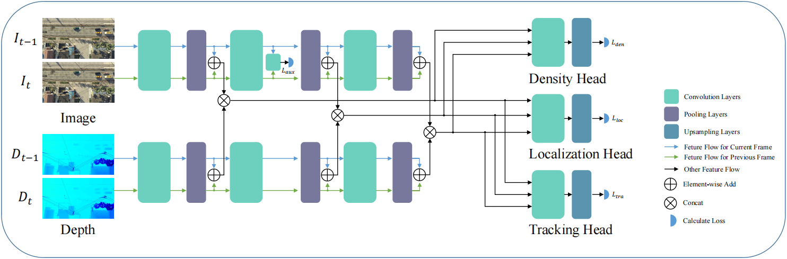

# SynthDrone
This is the official repository for [Synthetic Drone Monitoring](##TODO-Update-Paper-URL).

This work builds a synthetic drone monitoring framework named **Synthetic Drone**, which consists of the **SynthDrone-Generator** and the **SynthDrone-Labeler**.
Based on this data collection framework, we build the **SynthDrone** dataset. It contains 50 monitoring scenes with 5 weather and 6 time interval settings, a total of 300 video clips.
We also propose the Depth Aware Target Distribution estimation Network (DATDNet) to make use of the collected various data.

This repository contains following four parts:
<!-- 1. Synthetic Drone Raw Data Generation Framework (SynthDrone-Generator)
1. Synthetic Drone Raw Data Labeler (SynthDrone-Labeler)
2. SynthDrone Dataset (SynthDrone)
3. Depth Aware Target Distribution Estimation Network (DATDNet) -->

## 1. Synthetic Drone Raw Data Generator (SynthDrone-Generator)
SynthDrone-Generator is a Synthetic Drone Monitoring simulation and data generation tool based on GTAV Script Hook Dot Net plugin and written in C#.

For more details, please refer to [SyntheticDrone-Generator](SyntheticDrone-Generator).

## 2. Synthetic Drone Raw Data Labeler (SynthDrone-Labeler)
SynthDrone-Labeler is the data processor which transfer the raw data generated by the SyntheticDrone-Generator into appropriate data format. 
It is developed based on Python 3.

For more details, please refer to [SyntheticDrone-Labeler](SyntheticDrone-Labeler).

## 3. SynthDrone Dataset (SynthDrone)
SynthDrone is a multi-source dataset generated by the Synthetic Drone Synthetic Drone Monitoring Framework.

It is collected with 50 locations, 300 video clips, 18,000 frames and 2,171,133 entities. Each frame contains a 1920x1080 scene images and corresponding segmentation map, depth map, location, bounding box and id information for each entity.

For more details, please refer to [SynthDrone](SynthDrone).

## 4. Depth Aware Target Distribution Estimation Network (DATDNet)

For more details, please refer to [DATDNet](DATDNet)