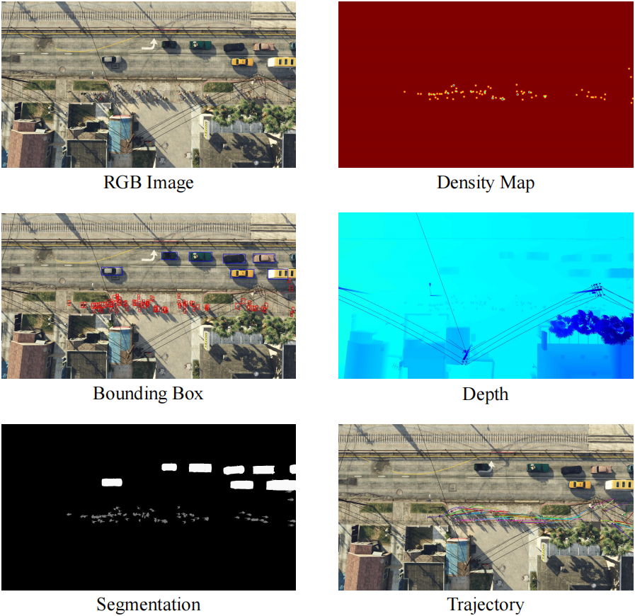

# SynthDrone Dataset
SynthDrone is a multi-source dataset generated by the Synthetic Drone Synthetic Drone Monitoring Framework.

It is collected with 50 locations, 300 video clips, 18,000 frames and 2,171,133 entities. Each frame contains a 1920x1080 scene images and corresponding segmentation map, depth map, location, bounding box and id information for each entity.

## Data 
```
- SynthDrone
    - ann
        - 1-04_09-Raining.json
        - 1-08_47-Foggy.json
        ...
    - dep
        - 1-04_09-Raining-0.npy
        - 1-04_09-Raining-1.npy
        ...
    - img
        - 1-04_09-Raining-0.jpg
        - 1-04_09-Raining-1.jpg
        ...
    - inf
        - 1-04_09-Raining.txt
        - 1-04_09-Foggy.txt
        ...
    - seg
        - 1-04_09-Raining-0.png
        - 1-04_09-Raining-1.png
        ...
```
### ann
Json files with following structure:
```
{"Frame ID":{"Ped":[Ped1, Ped2...], "Veh":[Veh1, Veh2...]}}
```
The Ped instance follows following structure:
```
["ID", [id, loc, isInVeh, isVis, isOcc, groInd, isOnScr, vehIsOn, leftP, rightP, rearP, frontP, Note]]
```
The Veh instance follows following structure:
```
["ID", [id, loc, isVis, isOcc, isOnScr, cla, disNam, locName, claDisName, claLocName, leftP, rightP, rearP, frontP]]
```
### dep
Depth information saved with numpy files(.npy).

### img
Jpeg images.
### inf
Scene information for each video clip, includes collection location, time, weather, height *et al*.
### seg
Segmentation Map for all concerned entities (Ped and Veh).

## Download
**Coming Soon**

**Attention:**

*Compressed:* All data with compressed Jpeg images.

*PNG Image:* Only contains PNG images.

---

Ali Cloud Disk [[Compressed](##)] [[PNG Image](##)]

OneDriver [[Compressed](##)] [[PNG Image](##)]
